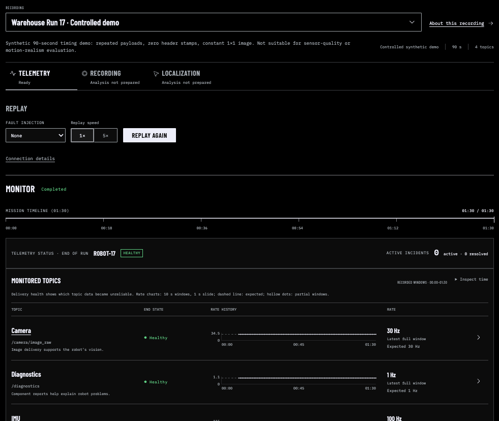
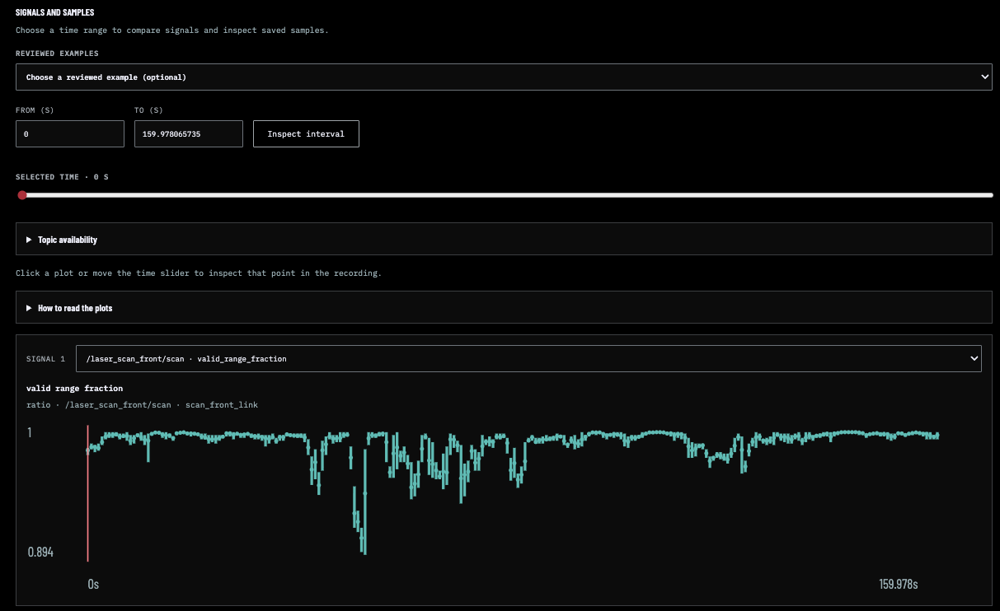

# ROS Telemetry Analytics

Find suspicious intervals in robot recordings, inspect the supporting evidence,
and understand what remains uncertain.

**ROS Workbench** brings three workflows into one local interface:

- **Telemetry:** replay a mission to see when topic delivery drops, gaps, or recovers.
- **Recording:** select a detected incident, inspect measurements and source samples,
  and follow suggested next checks. Explanations use deterministic rules—no LLM,
  API key, or replay required for prepared recordings.
- **Localization:** compare an AMCL failure detector with published reference
  trajectories and labels to understand missed events and false alarms.

The goal is to help you decide **where to investigate next**, with the evidence
and its limits visible. A warning does not establish a physical root cause.



_Replay a recording and inspect topic delivery._

## Try it locally

```bash
git clone https://github.com/mikeh-studio/ros-telemetry-analytics.git
cd ros-telemetry-analytics
mkdir -p data/investigations
docker compose up --build
```

Open [localhost:3000](http://localhost:3000). Start with the built-in warehouse
mission in **Telemetry**, choose 1× or 5× speed, and start replay. The optional
camera-dropout scenario runs at 1× and demonstrates detection and recovery.
You can also upload a `.bag`, `.mcap`, or `.db3` recording for replay.

For **Recording** analysis, install and prepare the public recordings using the
[recording guide](docs/recording-investigations.md#reproduce-locally). Select an
incident to see observations, possible explanations, uncertainty, and next checks.
**Rebuild evidence** updates an installed, registered recording directly from the
page. Uploads do not yet receive this prepared analysis automatically.



_Choose a time range and inspect recorded signals and samples._

## Analyze bags without the web app

Python 3.11+ on macOS or Linux; no ROS runtime, CUDA, or simulator required:

```bash
make setup
# Place recordings under data/raw/, then run:
make analyze
```

Start with `data/bronze/latest_report.md`. Each recording also gets a report and
structured Parquet/JSON evidence in `data/bronze/bags/<bag-id>/`. Inputs include
ROS 1 bags, ROS 2 bag directories, `.db3`, and `.mcap` files.

## Guides

| Use case                                        | Guide                                                                                           |
| ----------------------------------------------- | ----------------------------------------------------------------------------------------------- |
| Replay recordings and inspect topic delivery    | [ROS Workbench](docs/flight-deck.md)                                                            |
| Investigate incidents without replay            | [Recording analysis](docs/recording-investigations.md)                                          |
| Configure batch checks and inspect output       | [Bag analysis](docs/bag-analysis.md)                                                            |
| Evaluate localization detection                 | [Localization evaluation](docs/localization-evaluation.md)                                      |
| Connect live ROS 2 topics                       | [Optional gateway and simulation](docs/live-ros2.md)                                            |
| Understand implementation and validation limits | [Architecture](docs/architecture.md) · [Reliability case study](docs/reliability-case-study.md) |

**Status: Alpha.** Intended for engineering triage and dataset QA, not safety-critical
control or certification. Timing checks use recorded receive timestamps; they do
not establish hardware synchronization or sensor accuracy. Live ROS 2 integration
has separate runtime requirements and [validation gates](docs/reliability-roadmap.md).

Browse the [documentation index](docs/README.md) for validation records and design context.

## Development

```bash
make setup
make format
make lint
make test
npm --prefix demo/web ci
npm --prefix demo/web test
npm --prefix demo/web run build
```

See [contributing](CONTRIBUTING.md) for test expectations and
[validation datasets](docs/validation-data.md) for optional public recordings.
Report vulnerabilities through [SECURITY.md](SECURITY.md).

## License

[MIT](LICENSE) for source code. Recordings and other third-party inputs retain
their own licenses.
