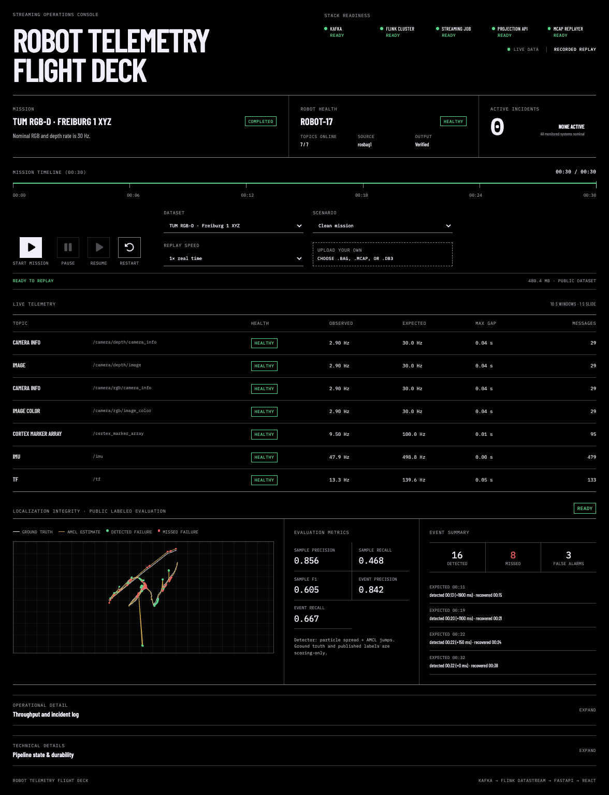

# ROS Telemetry Analytics

Troubleshoot robot missions from recorded ROS telemetry. Detect sensor dropouts
and timing anomalies, evaluate localization failures, and investigate incidents
in an interactive Flight Deck.



*Completed TUM RGB-D replay, with a separate public localization evaluation below.*

- **Analyze recordings:** turn ROS 1 and ROS 2 bags into sensor-health reports,
  anomaly events, and inspectable Parquet and JSON evidence.
- **Replay missions:** choose a dataset or upload a recording, replay it through
  Kafka and Flink, and inspect topic health in a React operations console.
- **Evaluate localization:** score an AMCL failure detector against published
  ground-truth trajectories and failure labels.

The Python analysis runs locally on macOS and Linux without ROS, CUDA, or a
simulator. The Flight Deck runs with Docker Compose and uses recorded replay;
a live ROS 2 bridge is a future extension.

> **Status:** Alpha. Supports engineering triage and dataset QA, not
> safety-critical control or certification.

## Try the Flight Deck

Clone the repository and start the stack with Docker Compose:

```bash
git clone https://github.com/mikeh-studio/ros-telemetry-analytics.git
cd ros-telemetry-analytics
docker compose up --build
```

Open [localhost:3000](http://localhost:3000), select a dataset, and start a 1x
or 5x replay. The built-in warehouse mission includes a camera-dropout scenario
at 1x speed for inspecting gaps, late arrivals, and recovery.

You can also upload a `.bag`, `.mcap`, or `.db3` recording. Public datasets
can be replayed once installed; unavailable archives remain visible but
disabled. See the [Flight Deck guide](docs/flight-deck.md) for dataset
behavior, service endpoints, and checkpoint-recovery checks.

## Analyze recordings

From the repository root, using Python 3.11+:

```bash
make setup
# Place recordings under data/raw/, then run:
make analyze
```

Supported inputs include ROS 1 `.bag`, ROS 2 bag directories, and standalone
`.db3` and `.mcap` files. Start with `data/bronze/latest_report.md` for the run
summary; each recording also gets a report and structured evidence under
`data/bronze/bags/<bag-id>/`.

Checks cover message rates, gaps, topic-pair timing, and selected payload
features from odometry, IMU, TF, diagnostics, and images. Timing checks use
recorded receive timestamps and do not establish hardware synchronization.

See the [analysis guide](docs/bag-analysis.md) for custom input paths, output
schemas, thresholds, and reliability guarantees. Browse example
[sensor-health](examples/sample_report.md) and
[domain-analysis](examples/sample_domain_report.md) reports.

## Evaluate localization

The localization evaluator measures an observable-only AMCL detector against
published failure labels, keeping ground truth separate from detector inputs.
It produces sample and event metrics plus inspectable result files.

See the [evaluation guide](docs/localization-evaluation.md) for the command,
dataset setup, and baseline results, or read the
[sample evaluation](examples/sample_localization_eval.md).

## Repository layout

| Path | Contents |
| --- | --- |
| `src/ros_telemetry_analytics/` | Python ingestion, analysis, and CLI |
| `demo/` | Flight Deck API, replayer, shared contracts, and React UI |
| `streaming/flink-job/` | Java event-time processing and tests |
| `configs/` | Analysis rules, replay settings, and dataset manifests |
| `schemas/` | Versioned streaming JSON contracts |
| `tests/` | Python tests and fixtures |
| `scripts/` | Stack smoke, recovery, and batch-comparison checks |
| `docs/` | Usage guides, architecture, and design review |
| `examples/` | Committed sample reports |
| `artifacts/` | Design and UI review evidence |
| `data/` | Local recordings and generated analysis outputs |

## Development

```bash
make setup
make format
make lint
make test
```

See [architecture](docs/architecture.md) for the batch and streaming data flows,
[validation datasets](docs/validation-data.md) for optional public recordings,
and [contributing](CONTRIBUTING.md) for test expectations. Historical UI review
notes live in [design QA](docs/design-qa.md) and the
[UI audit](artifacts/ui-audit/ui-review.md).

Report vulnerabilities through [SECURITY.md](SECURITY.md).

## License

[MIT](LICENSE) for source code. ROS recordings and other third-party inputs
retain their own licenses.
