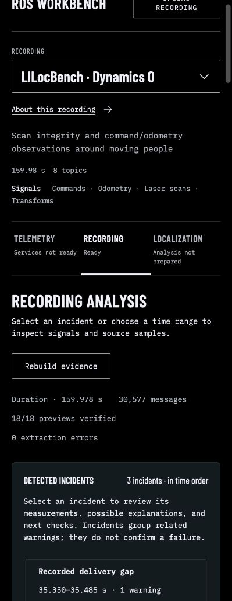
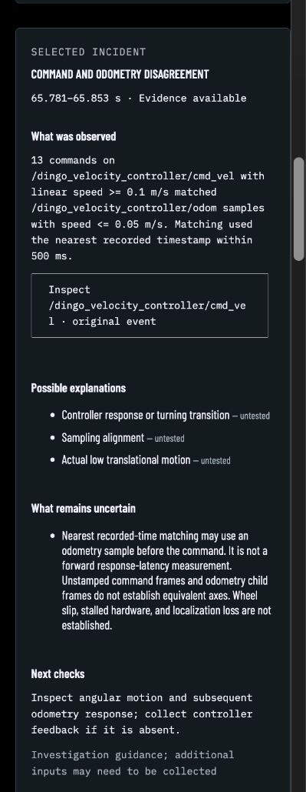

# Recording explanations: PR validation

Validated locally on 2026-09-22 against the implementation in this PR.

## Review and cleanup

- Reviewed detector provenance, conservative grouping, artifact publication and
  stale-evidence rejection, API pagination, and UI dataset/incident transitions.
- Fixed rebuild polling so a new completion callback cannot trigger another POST;
  a regression test checks one POST and delivery to the latest callback.
- Removed the redundant interval API branch and moved the event-identity import
  to module scope. Formatted changed frontend files and ran the Python formatter.
- Kept the README focused on use cases, setup, screenshots, and limitations;
  detailed contracts and operational behavior remain in the guides.
- Checked spacing across Telemetry, Recording, and Localization, including
  expanded evidence, pipeline, connection, operational, and upload panels.
  Replay controls wrap; pipeline status text and long topic paths stay inside
  their panels. Tabs retain equal widths and left alignment.

## Automated checks

| Check | Result |
| --- | --- |
| Ruff lint and formatting | Passed |
| Python suite | 276 passed; 91.06% package coverage |
| Frontend unit/interaction suite | 63 passed |
| Production frontend build | Passed |
| Python wheel and source distribution build | Passed |
| Docker Compose configuration | Passed |

The frontend suite includes selection/reset behavior, evidence navigation,
pagination, rebuild completion/failure, cancellation, and callback replacement.
The Python suite includes source/provenance reconciliation, grouping boundaries,
fallbacks, digest checks, publication failure, and targeted signals beyond the
normal display limit.

## Browser and data checks

The local browser review covers real prepared recordings and the completed
built-in replay. Phone (320px), tablet (800px), and desktop (1600px) layout checks
found no remaining overflow in the expanded panels inspected. This is a focused
layout and interaction review, not an exhaustive accessibility audit.

Fresh screenshots below use the offline local preview and LILocBench Dynamics 0
at the browser’s normal narrow width. Telemetry services are not started in this
preview. The captures show recorded observations, not confirmed physical faults.
The final preview also opened the exact odometry angular-velocity plot from its
evidence link with no browser errors.

All seven recordings were rebuilt successfully from the final source. The
[final preparation check](../examples/recording_incidents_pr_validation.json)
reconciles 317,443 messages, 270 warnings, 261 incidents, and 96 verified previews.
All incident documents pass the JSON schema; domain detector event tables match
the initial explanation validation exactly.

The earlier [seven-recording source validation](../examples/incident_explanation_validation_20260922_b031c10089ab4ed3b7477ac75cf8011c.json)
retains detector-parity and case measurements from the initial implementation.

## Limits

The full clean-stack replay/oracle/dropout workflow and browser regression suite
run in PR CI. Local browser checks do not replace those gates. This change adds
no physical-robot validation or causal ground truth. Rebuild jobs assume the
single-worker local API; uploads still require separate registration/preparation
for offline explanations.
